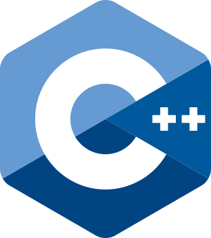

Bienvenue dans le tutoriel de C++ de l'EFREI Algo Team !
Vous y trouverez des aides pour démarrer, ainsi que des articles plus détaillés pour découvrir les notions plus avancées du langage.

{width=30%}

# Fiches introductives

Pour résoudre des problèmes d'algorithmiques en C++, les notions suivantes vous seront utiles !

- [**Résoudre un défi CodinGame**](cours/fiches/codingame.qmd) : un exemple résolution d'un défi CodinGame, avec entrées-sorties, conteneurs, fonctions de traitement et affichage du résultat.

- [**Le conteneur ``vector``**](cours/fiches/vector.qmd) : bien meilleur que les tableaux classiques du C, il connaît sa propre taille et se redimensionne automatiquement !

- [**Les entrées-sorties ``cin``-``cout``**](cours/fiches/cin-cout.qmd) : pour demander des valeurs à l'utilisateur, et afficher vos résultats.

- [**Le type ``string``**](cours/fiches/string.qmd) : pour gérer vos chaînes de caractères en toute simplicité.

- [**Les types ``enum``**](cours/fiches/enum.qmd) : pour écrire du code aussi clair et explicite que possible.

- [**Le conteneur ``optional``**](cours/fiches/optional.qmd) : lorsque la valeur *aucune valeur* est une option.

# Articles détaillés

Si vous souhaitez approfondir votre connaissance du langage, vous pouvez consulter les articles détaillés ci-dessous :

- [**Différences de syntaxe entre C et C++**](cours/bases/differences_c.qmd) : à destination des programmeurs C. Découvrez les différences principales du C++ avec le C, et les nombreux avantages qu'il comporte.

- *(D'autres articles à venir)*